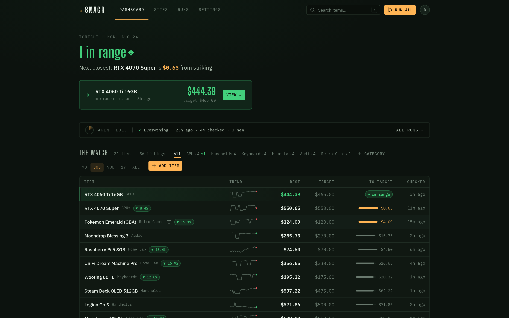
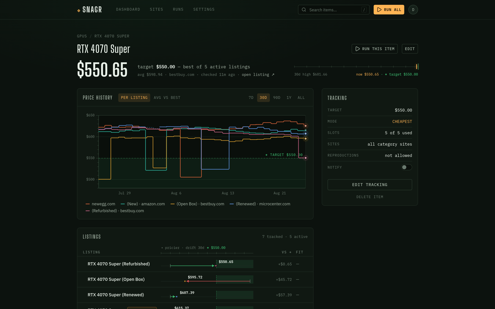

# Snagr

[](https://github.com/oldmoldycake/Snagr/actions/workflows/ci.yml)
[](https://github.com/oldmoldycake/Snagr/actions/workflows/codeql.yml)
[](LICENSE)

A self-hosted price tracker for secondhand-marketplace hunting. You describe what you're watching for and at what price; an LLM agent drives a real headless browser to find new listings and re-check known ones, and the web UI shows every hunt's state at a glance — current best price, drift against your target, price history, and live run progress.

**Status: pre-release.** The contract-first frontend is complete; the backend is being built to it. Expect rough edges and no versioned releases yet.





## Features

- **Watches, not bookmarks** — track an *item* across multiple marketplace sites at once, with a target price and free-form criteria the agent applies when judging listings.
- **LLM scraping through a real browser** — the agent works marketplace pages via [Playwright MCP](https://github.com/microsoft/playwright-mcp), so it sees what you'd see. The model is pluggable: any [LangChain `init_chat_model`](https://python.langchain.com/docs/how_to/chat_models_universal_init/) provider (OpenRouter, OpenAI, Anthropic, Ollama, Groq, …) via four env vars.
- **Price history that means something** — every re-check is recorded; the UI derives best/average price, sparklines, and percent drift from the raw checks. Prices are exact decimals end-to-end, never floats.
- **Runs from the UI** — trigger a scrape pass from the browser, watch it live over SSE, or put runs on a schedule.
- **Market-price grounding** — the agent periodically refreshes a reference market price per item so "is this a deal?" has a denominator.
- **Visual authenticity (optional)** — a DINOv3 sidecar embeds listing photos and scores them against reference images, flagging stock-photo reposts and suspicious listings. Fully opt-in; the stack runs without it.
- **Self-host-friendly auth** — httpOnly cookie sessions with rotating refresh tokens, optional OIDC SSO (Authentik, Keycloak, …), first registered user becomes admin. Notifications via your own [ntfy](https://ntfy.sh) server.

## Architecture

Four independently-deployed components in one repo, sharing one PostgreSQL database (**pgvector required**):

| Component | What it is | Runs as |
|---|---|---|
| `backend/` | FastAPI JSON API (async SQLAlchemy 2.0 / asyncpg), owns the schema + Alembic migrations | server on `:8000` |
| `frontend/` | React 19 + Vite + Tailwind v4 SPA, served by nginx which proxies `/api` | server on `:80` |
| `agent/` | LangChain scraper batch job driving Playwright MCP | scheduled / queue-ticker, not a server |
| `vision/` | optional visual-authenticity sidecar (DINOv3 embeddings, MinIO object store) | server on `:8100`, opt-in |

External pieces: PostgreSQL with the [pgvector](https://github.com/pgvector/pgvector) extension, a [Playwright MCP](https://github.com/microsoft/playwright-mcp) endpoint for the agent, and an LLM API key (or a local model server).

## Installing

Production deployment docs (a copy-paste `deploy/` compose stack with bundled Postgres) are landing shortly — until then, the development stack below is the way to run Snagr.

## Development

Each Python component keeps its own `venv/`; the frontend is plain npm. The fastest full stack is compose:

```bash
git clone https://github.com/oldmoldycake/Snagr.git && cd Snagr

# 1. Point the components at your Postgres (pgvector installed) and Playwright MCP
cp backend/.env.example backend/.env   # DATABASE_URL, JWT_SECRET, ...
cp agent/.env.example agent/.env       # AI_* provider vars, PLAYWRIGHT_MCP_URL, DATABASE_URL

# 2. Create the schema
cd backend && python -m venv venv && ./venv/bin/pip install -r requirements.txt
./venv/bin/alembic upgrade head && cd ..

# 3. Run everything
docker compose up --build   # frontend :8081, backend :8000, agent run-queue ticker
```

The frontend also runs fully standalone on a mock API (`VITE_USE_MOCKS=true` + `npm run dev` in `frontend/`) — see [frontend/README.md](frontend/README.md). Backend architecture is documented file-by-file in [backend/STRUCTURE.md](backend/STRUCTURE.md).

To enable the visual-authenticity sidecar: `docker compose --profile vision up --build` after `cp vision/.env.example vision/.env` — it needs an HF token for the gated DINOv3 weights and degrades gracefully without one.

## Configuration

Each component reads its own `.env`; the annotated `.env.example` files are the authoritative reference:

| File | The important ones |
|---|---|
| [`backend/.env.example`](backend/.env.example) | `DATABASE_URL`, `JWT_SECRET` (generate one!), `COOKIE_SECURE`, `REGISTRATION_OPEN`, `OIDC_*`, `NTFY_SERVER_URL` |
| [`agent/.env.example`](agent/.env.example) | `AI_PROVIDER` / `AI_MODEL` / `AI_URL` / `AI_API_KEY`, `PLAYWRIGHT_MCP_URL`, `DATABASE_URL`, `EXPECTED_CURRENCY` |
| [`vision/.env.example`](vision/.env.example) | `DATABASE_URL` (sync driver), `S3_*`, `HF_TOKEN` |

## Security posture

Snagr is built to live on a trusted LAN behind your own reverse proxy:

- The web app is the only thing meant to be exposed; put HTTPS in front of it and set `COOKIE_SECURE=true`.
- Auth tokens live in httpOnly cookies (JS never sees them); mutations require a CSRF header.
- The Playwright MCP, vision sidecar, and MinIO are **LAN-internal and unauthenticated by design** — bind them to trusted interfaces only and never publish their ports.

Found a vulnerability? See [SECURITY.md](SECURITY.md).

## Contributing

Issues and PRs welcome — [CONTRIBUTING.md](CONTRIBUTING.md) covers the dev setup, the test contract, and the conventions CI enforces.

## License

[AGPL-3.0](LICENSE). Run it, change it, share it — if you host a modified Snagr for others, share your changes too.
