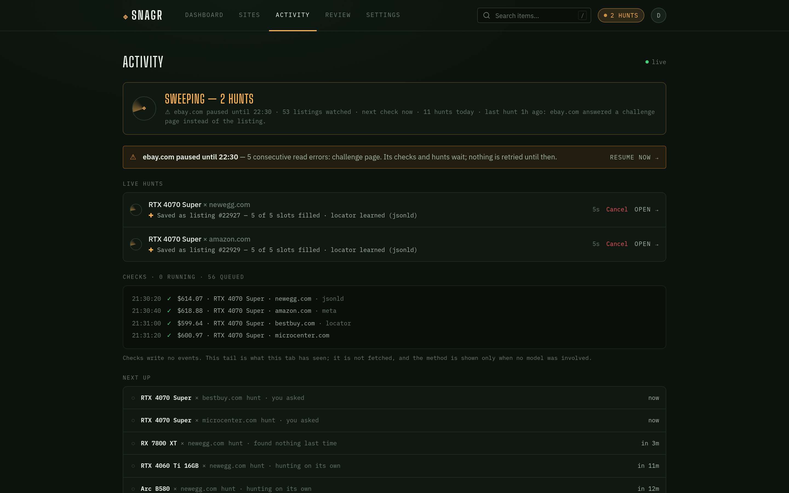
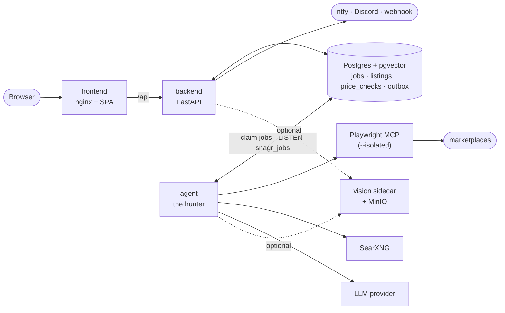

# Snagr

[](https://github.com/oldmoldycake/Snagr/actions/workflows/ci.yml)
[](https://github.com/oldmoldycake/Snagr/actions/workflows/codeql.yml)
[](https://github.com/oldmoldycake/Snagr/releases)
[](LICENSE)

A self-hosted price tracker for secondhand-marketplace hunting. You describe what you're watching for and at what price; an always-on agent drives a real headless browser to find new listings and re-check known ones, and the web UI shows every hunt's state at a glance — current best price, drift against your target, price history, and what the hunter is doing right now.

**Status: early (0.x).** The whole stack runs end to end, every push to `main` publishes container images, and release-please cuts a tagged release from the [CHANGELOG](CHANGELOG.md). Expect rough edges, and read the release notes before upgrading between minor versions.





*All three screenshots are the frontend's built-in mock data (see [Development](#development)).*

## Contents

- [Features](#features)
- [How it works](#how-it-works)
- [Requirements](#requirements)
- [Quick start](#quick-start)
- [First run](#first-run)
- [Deploying from the images](#deploying-from-the-images)
- [Upgrading](#upgrading)
- [Configuration](#configuration)
- [Visual authenticity (optional)](#visual-authenticity-optional)
- [Connecting an agent (MCP)](#connecting-an-agent-mcp)
- [Webhooks](#webhooks)
- [Security posture](#security-posture)
- [Development](#development)

## Features

- **Watches, not bookmarks** — track an *item* across several marketplace sites at once, with a target price, free-form criteria the agent applies when judging listings, a selection mode (`cheapest` or `best_match`), and a slot budget so a watch never balloons past the number of listings you asked for.
- **LLM scraping through a real browser** — the agent works marketplace pages via [Playwright MCP](https://github.com/microsoft/playwright-mcp), so it sees what you'd see. The model is pluggable: any [LangChain `init_chat_model`](https://python.langchain.com/docs/how_to/chat_models_universal_init/) provider via four env vars. The agent ships adapters for OpenRouter, OpenAI, Anthropic, Google, Ollama, Groq, Mistral, Together, Fireworks, xAI, DeepSeek, Cohere, and AWS Bedrock.
- **An agent that is always on** — the agent is a daemon working a queue, not a batch job you start. A new watch is being hunted within seconds, and keeps being hunted on its own while it has open slots — backing off from 15 minutes to 6 hours while a site has nothing new, and stopping once every slot is filled until one frees. On a full watch, **Hunt for better** asks for one more look: a hunt that swaps out the weakest tracked listing only for something better (in cheapest mode, only for a strictly lower price). Tracked listings are re-read on their own every half hour, or at a watch's own interval; **Hunt now** and **Check prices** jump the queue; and a watch can switch its own hunting off. The Activity page shows every hunt's log live, what is queued next, and the history.
- **Most re-checks never call the model** — the first time the model confirms a listing's price, code learns where on that page the price lives and replays that on every later check; where the same locator works against the raw HTML, the check is a plain HTTP GET with no browser at all. A site that starts answering challenge pages trips a circuit breaker and is left alone — an hour at first, doubling on each repeat trip up to a day — rather than burning tokens on every listing.
- **Price history that means something** — every re-check is recorded; best/average price, sparklines, and percent drift are derived from the raw checks. Prices are `Numeric(10,2)` in the database and decimal strings in the API, never floats. A reading wildly out of line is recorded but disbelieved — it never counts, and only a second read that agrees with it is believed — and auction bids are never recorded as prices (Buy It Now is the exception), so neither a scraping slip nor a $1 opening bid can fake a target hit.
- **Market-price grounding** — the agent periodically researches a reference market price per item and condition tier (price guides first, then a broad [SearXNG](https://docs.searxng.org) snippet search) so "is this a deal?" has a denominator.
- **Notifications you own** — when a watch's best price crosses its target, or a genuinely new listing shows up, the backend delivers it to the channels you configure under Settings: your own [ntfy](https://ntfy.sh) server, a Discord channel, or any webhook (HMAC-signed JSON, so other tools can build on top). Target hits are edge-triggered with a cooldown, so a listing that merely stays cheap isn't re-announced every night.
- **Agents as users** — the same operations the web app uses are exposed over the [Model Context Protocol](https://modelcontextprotocol.io), so Claude Code or any MCP client can browse your watches and ask the hunter for work with a scoped API token.
- **Visual authenticity (optional)** — a DINOv3 sidecar embeds listing photos and scores them against a per-item reference library of real and fake examples. Suspicious listings are flagged on the board, and their photos land in a review queue where confirming one grows the library. Fully opt-in; the stack runs without it.
- **Self-host-friendly auth** — httpOnly cookie sessions with rotating refresh tokens, optional OIDC SSO (Authentik, Keycloak, …), first registered user becomes admin, and registration is invite-only after that unless you open it.

## How it works



The backend and the agent never talk to each other directly; the database is the whole interface. The backend writes a row to the `jobs` table ("hunt this watch", "check this listing now"), and the agent — woken by `NOTIFY` — claims it, works it, and writes what it found back. Hunt progress and price checks reach the browser the same way: database triggers wake the backend, which pushes them over a server-sent event stream. Notifications work alike — the agent queues an outbox row, and the backend delivers it.

| Component | What it is | Runs as |
|---|---|---|
| `backend/` | FastAPI JSON API (async SQLAlchemy 2.0 / asyncpg); owns the schema + Alembic migrations, delivers notifications, serves MCP | server on `:8000` |
| `frontend/` | React 19 + Vite + Tailwind v4 SPA, served by nginx which proxies `/api` | server on `:80` (compose publishes it on `:8081`) |
| `agent/` | LangChain agent daemon driving Playwright MCP — claims jobs from the DB and works them | `main.py --serve`, or `--once` under cron |
| `vision/` | optional visual-authenticity sidecar (DINOv3 embeddings, S3-compatible object store — MinIO in the compose profile) | server on `:8100`, opt-in |

## Requirements

- **PostgreSQL with the [pgvector](https://github.com/pgvector/pgvector) extension** — required whether or not the vision sidecar is enabled (the schema carries embedding columns either way). The [`pgvector/pgvector`](https://hub.docker.com/r/pgvector/pgvector) image ships it preinstalled; on an existing server, install the distro package (e.g. `postgresql-18-pgvector` on Debian/Ubuntu, matching your major version) and enable it once per database as a superuser:

  ```sql
  CREATE EXTENSION vector;
  ```

- A [Playwright MCP](https://github.com/microsoft/playwright-mcp) endpoint the agent can reach, **started with `--isolated`**. The agent opens one browser context per job so a check never waits behind a hunt, and a server running on a persistent profile refuses the second session outright ("Browser is already in use"). Two flags are worth adding:

  ```
  npx @playwright/mcp@latest --port 8931 --isolated \
    --storage-state ./consent.json \
    --blocked-origins "localhost;127.0.0.1;backend;vision;minio;snagr-postgres"
  ```

  `--storage-state` seeds cookie-consent state into every fresh context (an isolated context starts with none). `--blocked-origins` is defence in depth for the agent's own URL guard: the pages it reads are untrusted, and nothing they suggest should be able to point the browser at your own services. It takes origins, not CIDR ranges — list the names your stack actually resolves — and Playwright notes that it does not affect redirects, which is why the agent guards every URL itself as well.
- An LLM API key — or a local model server — for any [LangChain `init_chat_model`](https://python.langchain.com/docs/how_to/chat_models_universal_init/) provider.
- A [SearXNG](https://docs.searxng.org) instance with the JSON output format enabled, for market-price grounding. Without one, grounding attempts fail and are logged; hunting and price checks are unaffected.
- **Docker + Docker Compose v2** for the reference stack. To run components outside Docker instead: **Python 3.14** (a hard floor — the backend and agent use 3.14-only syntax) and **Node 22** (what CI and the images use).

## Quick start

The dev compose stack is the reference wiring: it builds the frontend, backend and the hunter from source. Postgres, the Playwright MCP and SearXNG stay external.

```bash
git clone https://github.com/oldmoldycake/Snagr.git && cd Snagr

# 1. Configure the components (the .env.example files are annotated)
cp backend/.env.example backend/.env   # DATABASE_URL, JWT_SECRET, ...
cp agent/.env.example agent/.env       # AI_* provider vars, PLAYWRIGHT_MCP_URL, SEAR_XNG_URL, DATABASE_URL
$EDITOR agent/.env.docker              # container-side overrides, see below

# 2. Create the schema (run CREATE EXTENSION vector first — see Requirements)
docker compose run --rm backend alembic upgrade head

# 3. Run everything
docker compose up --build   # frontend :8081, backend :8000, the hunter
```

Then open `http://localhost:8081`.

**Addresses have to work from inside a container.** `backend/.env` is read by the backend container, so its `DATABASE_URL` must name a host the container can reach (a LAN IP or hostname — not `localhost`). `agent/.env` is written for running the agent on the host, so compose layers `agent/.env.docker` over it (gitignored, no example file; compose refuses to start without it):

```ini
# agent/.env.docker
DATABASE_URL=postgresql+asyncpg://snagr:…@192.168.1.10:5432/snagr
PLAYWRIGHT_MCP_URL=http://192.168.1.10:8931/mcp
# VISION_SIDECAR_URL=http://vision:8100   # only with the vision profile
```

The compose `agent` service runs `main.py --serve`: the hunter LISTENs for work and claims it as it appears, so a UI-triggered hunt or "check prices" starts in seconds rather than on the next tick. It also takes back any job whose worker died (no heartbeat for five minutes), so a crash costs a retry rather than a stuck queue slot.

## First run

1. **Register.** The first account on a fresh instance becomes the admin; after that, registration is invite-only (Settings → Users) unless `REGISTRATION_OPEN=true`.
2. **Add the marketplaces** you hunt on: Sites → **Add site** (a name and a base URL).
3. **Group them into a category**: **New category**, then edit it to link its sites. The hunter searches an item on its category's sites, so a category with no sites gets no hunts.
4. **Add an item**: **Add item**, pick the category, name the thing you want and (optionally) a target price. On the item page, **Edit tracking** sets what you're looking for (the criteria the agent judges listings by), how to pick listings, how many to track, the check interval, whether it hunts on its own, and which of the category's sites to search.
5. **Watch it work.** The first hunt starts within seconds — follow it on the Activity page. From then on the watch is hunted while it has open slots and its listings are re-checked on their own; set up a channel under Settings → Notifications to hear about target hits.

## Deploying from the images

There is no production compose stack yet — the [Quick start](#quick-start) stack is the reference wiring. CI publishes an image per component to GHCR:

```
ghcr.io/oldmoldycake/snagr-backend
ghcr.io/oldmoldycake/snagr-frontend
ghcr.io/oldmoldycake/snagr-agent
ghcr.io/oldmoldycake/snagr-vision
```

| Tag | Tracks |
|---|---|
| `:latest`, `:X.Y`, `:X.Y.Z` | tagged releases (no bare `:X` while the major version is 0) |
| `:dev` | the tip of `main` |
| `:sha-<short>` | one commit |

Images are published for `linux/amd64` only — on arm64, build from source. They are configured entirely through the env vars under [Configuration](#configuration), and run their baked-in commands: uvicorn on `8000` (backend), nginx on `80` (frontend), uvicorn on `8100` (vision), and for the agent **`main.py --once`** — queue what is due, drain the queue, exit. That default is the cron shape (`agent/.env.example` has the crontab line); for the always-on hunter, **override the agent's command with `python main.py --serve`**, as the dev compose file does. Run `alembic upgrade head` from the backend image before starting a new version.

## Upgrading

1. Read the release notes in the [CHANGELOG](CHANGELOG.md).
2. Pull (or rebuild) every component — they share one schema, so upgrade them together.
3. Migrate: `docker compose run --rm backend alembic upgrade head` (or `./venv/bin/alembic upgrade head` in `backend/`).
4. Restart the backend, the agent and the frontend.

**pgvector.** Installs from before migration 009 need the extension: `alembic upgrade head` stops at 009 with exactly this instruction —

> Snagr now requires the pgvector extension. Run `CREATE EXTENSION vector;` as your Postgres admin (see README → Requirements), then re-run `alembic upgrade head`.

— and enabling it and re-running the migration is the whole upgrade; no data changes.

**Settings that live on both sides.** `HUNT_ENABLED`, `RECHECK_INTERVAL_MINUTES` and `RECHECK_INTERVAL_FLOOR_MINUTES` are read by the agent (which acts on them) *and* the backend (which reports and enforces them in the UI and API). When a release adds one of these, set it in both env files with the same value.

## Configuration

Each component reads its own `.env`; the annotated `.env.example` files are the authoritative reference, and every variable is optional unless the example says otherwise.

| File | The important ones |
|---|---|
| [`backend/.env.example`](backend/.env.example) | `DATABASE_URL`, `JWT_SECRET` (generate one!), `ACCESS_TTL_MIN` / `REFRESH_TTL_DAYS`, `COOKIE_SECURE`, `REGISTRATION_OPEN`, `OIDC_*`, `NTFY_SERVER_URL`, `VISION_SIDECAR_URL`, `MCP_ENABLED`, and — with the same values as the agent's — `RECHECK_INTERVAL_MINUTES`, `RECHECK_INTERVAL_FLOOR_MINUTES`, `HUNT_ENABLED` |
| [`agent/.env.example`](agent/.env.example) | **provider** `AI_PROVIDER` / `AI_MODEL` / `AI_URL` / `AI_API_KEY` · **connections** `DATABASE_URL`, `PLAYWRIGHT_MCP_URL`, `SEAR_XNG_URL`, `VISION_SIDECAR_URL` / `VISION_TIMEOUT_SECONDS` · **hunting** `HUNT_ENABLED`, `HUNT_CONCURRENCY`, `HUNT_BACKOFF_MIN_MINUTES` / `HUNT_BACKOFF_CAP_MINUTES` · **checks** `RECHECK_INTERVAL_MINUTES` (the default a watch's own "check every" overrides) / `RECHECK_INTERVAL_FLOOR_MINUTES`, `RECHECK_CONCURRENCY`, `CHEAP_RECHECK`, `STATIC_FETCH`, `LOCATOR_MAX_FAILURES` · **safety** `SITE_BREAKER_*`, `PRICE_BAND_LOW` / `PRICE_BAND_HIGH` / `PRICE_MARKET_FLOOR`, `EXPECTED_CURRENCY`, `NOTIFY_COOLDOWN_HOURS` · **lifecycle** `JOB_*`, `HUNT_RETENTION_DAYS`, `AGENT_MAX_STEPS` / `AGENT_UNIT_TIMEOUT_SECONDS` · **grounding** `MARKET_PRICE_TTL_HOURS`, `MARKET_PRICE_MAX_REFRESH_PER_RUN` · optional LangSmith / Langfuse tracing |
| [`vision/.env.example`](vision/.env.example) | `DATABASE_URL` (sync `postgresql+psycopg://` driver), `S3_*`, `HF_TOKEN`, `VISION_MODEL` (must embed at dim 384), `VISION_RETENTION_DAYS` |
| compose environment (root `.env` or your shell; `vision` profile only) | `MINIO_ROOT_USER`, `MINIO_ROOT_PASSWORD` — must match `S3_ACCESS_KEY` / `S3_SECRET_KEY` in `vision/.env` |

[`agent/STRUCTURE.md`](agent/STRUCTURE.md) has every agent variable with its default and what it does.

### The panic button

`HUNT_ENABLED=false` stops all hunting — nothing new is queued, queued hunts wait unclaimed, and "hunt now" answers 409 — while tracked prices keep being rechecked. Set it in **both** `backend/.env` and the agent's env (`agent/.env`, or `agent/.env.docker` under compose) and restart both: the agent is what stops, and the backend is what refuses "hunt now" and shows "hunting paused by the operator" in the UI. To stop hunting a single watch instead, switch its **Hunting** off on the item page.

## Visual authenticity (optional)

The sidecar embeds listing photos with DINOv3 and scores them against each item's reference library. To enable it under compose:

1. `cp vision/.env.example vision/.env` and set its `S3_SECRET_KEY` (it ships as `CHANGE_ME`) to match the compose MinIO password — `MINIO_ROOT_USER` / `MINIO_ROOT_PASSWORD` default to `snagr-minio` / `snagr-minio-secret`, and the sidecar can't reach its bucket until the two agree.
2. Set `VISION_SIDECAR_URL=http://vision:8100` in `backend/.env` and `agent/.env.docker`. The profile only starts the sidecar; each component switches the feature on when that var is set (use `http://localhost:8100` only when the backend or agent runs on the host).
3. `docker compose --profile vision up --build`.

The [DINOv3 weights](https://huggingface.co/facebook/dinov3-vits16plus-pretrain-lvd1689m) are license-gated: accept the license and set `HF_TOKEN` in `vision/.env`, or the sidecar starts degraded (`/health` says so) and scoring is skipped. Review surfaces (the Review tab, authenticity badges, the reference library) appear in the UI only while the feature is on.

## Connecting an agent (MCP)

Snagr speaks the [Model Context Protocol](https://modelcontextprotocol.io): the same operations the web app uses are exposed as tools at `POST /api/mcp`, so Claude Code, Hermes, OpenClaw or any MCP client can browse your items, prices and the hunter's activity on your behalf and, with the right scope, add watches, edit them and ask the hunter for work.

1. **Settings → MCP & API → New token** — pick an access preset (**Read only**, **Read & write**, or **Full**, which can also queue hunts and price checks — each hunt spends LLM tokens) and copy the token; it is shown once.
2. Paste the ready-made config for your client from the same page. For Claude Code:
   ```bash
   claude mcp add --transport http snagr https://snagr.example.com/api/mcp --header "Authorization: Bearer snagr_pat_…"
   ```

Tokens are scoped (`read` / `write` / `jobs`), never reach account or admin routes, and double as a bearer credential on the REST API. `MCP_ENABLED=false` turns the whole surface off. claude.ai and Claude Desktop connectors need OAuth sign-in, which Snagr doesn't offer yet — use a client that sends a bearer header.

## Webhooks

A `webhook` channel (Settings → Notifications) POSTs a signed, versioned envelope for
every event it's subscribed to. Two events exist today.

**`target.hit`** — a price check made a watch's best price cross its target (edge-triggered: a price that was already at or under target doesn't fire again):

```json
{ "version": 1, "id": 123, "event": "target.hit",
  "occurred_at": "2026-09-01T05:12:00+00:00",
  "data": { "watch_id": 4, "item_id": 12, "listing_id": 88, "site_id": 2,
            "item_name": "…", "site_name": "…", "listing_url": "…",
            "price": "449.99", "currency": "USD", "target_price": "500.00",
            "method": "jsonld", "confirmed": true } }
```

`method` is how the price was read (`llm`, or a replayed `jsonld` / `meta` / `microdata` / `locator`); `confirmed` is always `true` here, because a disbelieved reading never notifies.

**`listing.new`** — a hunt saved a genuinely new listing. It carries no price yet (the first check follows):

```json
{ "version": 1, "id": 124, "event": "listing.new",
  "occurred_at": "2026-09-01T05:14:00+00:00",
  "data": { "watch_id": 4, "item_id": 12, "listing_id": 89, "site_id": 2,
            "item_name": "…", "site_name": "…", "listing_url": "…",
            "title": "…", "match_score": 87, "match_summary": "…" } }
```

`id` is the outbox id — retries reuse it, so dedupe on it. The exception is a **Send
test** delivery, which carries `event: "test"`, `id: 0` and an empty `data` object:
exclude `event: "test"` before keying on `id`, or your second test send will look
like a duplicate. Every request carries
`X-Snagr-Event`, `X-Snagr-Delivery` (the delivery id, or `test` for a test send),
`X-Snagr-Timestamp` (unix seconds), and `X-Snagr-Signature: sha256=<hex>` where

```
signature = HMAC_SHA256(secret, "{timestamp}." + raw_body_bytes)
```

The signing secret is server-generated and shown exactly once, in the create response
(rotation = delete and recreate). To verify: recompute over the exact bytes you received,
compare constant-time, and reject when `|now - timestamp| > 300s`. Ignore `event` values
you don't recognise — the set grows, and channels subscribed to all events pick up new
ones automatically. Delivery retries with backoff (30s / 5m / 30m / 2h, 5 attempts).

Destination URLs are user-supplied and POSTed without an IP blocklist — deliberate for a
self-hosted instance where every account belongs to the operator's household.

## Security posture

Snagr is built to live on a trusted LAN behind your own reverse proxy:

- The web app is the only thing meant to be exposed; put HTTPS in front of it and set `COOKIE_SECURE=true`.
- Auth tokens live in httpOnly cookies (JS never sees them); mutations require a CSRF header.
- Agents and scripts use **API tokens** instead (Settings → MCP & API): a `snagr_pat_…` bearer credential, stored hashed, scoped to read / write / jobs, and never able to touch the account that owns it. Set `MCP_ENABLED=false` to turn that whole surface off.
- The Playwright MCP, vision sidecar, and MinIO are **LAN-internal and unauthenticated by design** — bind them to trusted interfaces only. The same goes for the SearXNG instance the agent queries. (The dev compose stack publishes the backend on `:8000` and the sidecar on `:8100` so host-run dev servers can reach them; drop those mappings, or bind them to `127.0.0.1`, for anything long-lived.)

**Marketplace pages are untrusted input**, and the agent reads them with a
real browser before typing what it found into the database:

- A listing URL must belong to the site it was found on, and must never be a
  private, loopback, link-local or otherwise reserved address, or a bare
  container name. The URL is stored and re-visited on every future price
  check, so accepting one a page chose would be accepting a standing request
  — including one aimed at Snagr's own backend or the vision sidecar. The
  same rule guards every navigation the model asks for and the browserless
  price fetch. One accepted cost: a listing that genuinely redirects to a
  sister domain (`ebay.com` → `ebay.co.uk`) is refused rather than followed.
- **Titles, match summaries and rejection notes are untrusted display text.**
  They reach your ntfy / Discord / webhook bodies and the agent's own later
  prompts, so they are capped, flattened to a single line and stripped of
  control characters — but they are still words a stranger wrote. Treat them
  as you would any listing text, and do not wire a notification into
  something that acts on them unread.
- **Prices are checked for plausibility before anything acts on them.** A
  reading wildly out of line with the listing's own history or the item's
  market value is recorded but marked unconfirmed: it never notifies, and it
  stays out of every chart and average. Only when the next reading lands
  within 1% of it is that next reading believed.
  A consumer of the API that buys automatically should require `confirmed: true`.

Found a vulnerability? See [SECURITY.md](SECURITY.md).

## Development

Each Python component keeps its own `venv/` (Python 3.14); the frontend is plain npm (Node 22). To work on one component, run it on the host against the rest:

```bash
cd backend && python -m venv venv && ./venv/bin/pip install -r requirements.txt
./venv/bin/alembic upgrade head
./venv/bin/uvicorn app.main:app --reload --port 8000

cd frontend && npm ci && npm run dev   # :5173, proxies /api to localhost:8000
```

The frontend also runs fully standalone on a mock API seeded with a year of price history — `VITE_USE_MOCKS=true npm run dev` in `frontend/`, sign in with `demo@snagr.dev` / `snagr`. Press **Hunt now** on an item to watch a scripted hunt stream into the Activity page. See [frontend/README.md](frontend/README.md).

Running compose from a git worktree? Pass `-p snagr` (`docker compose -p snagr up --build`), or compose names the project after the worktree's directory and starts a second, separate stack.

Where to read next:

- [AGENTS.md](AGENTS.md) — the working guide: commands, the test model, the invariants, and the house rules (also what coding agents read).
- [backend/STRUCTURE.md](backend/STRUCTURE.md) and [agent/STRUCTURE.md](agent/STRUCTURE.md) — each component file by file, with the rules that aren't obvious from the code.
- [docs/design/](docs/design/) — the design records behind the hunter and the Activity page.

## Contributing

Issues and PRs welcome — [CONTRIBUTING.md](CONTRIBUTING.md) covers the dev setup, the test contract, and the conventions CI enforces.

## License

[AGPL-3.0](LICENSE). Run it, change it, share it — if you host a modified Snagr for others, share your changes too.
